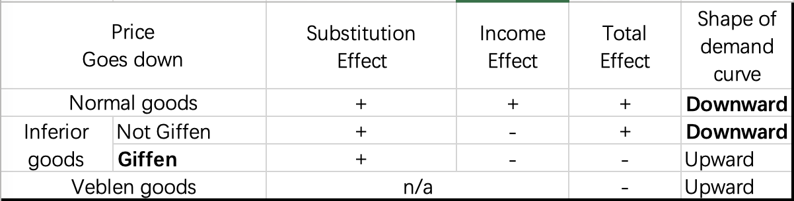
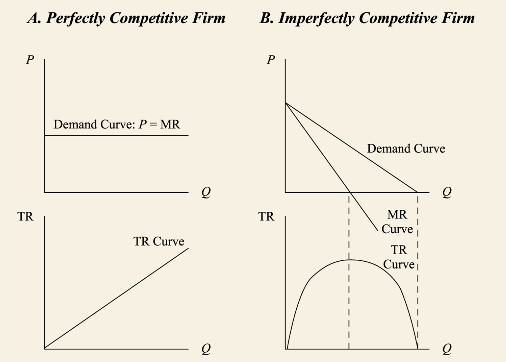
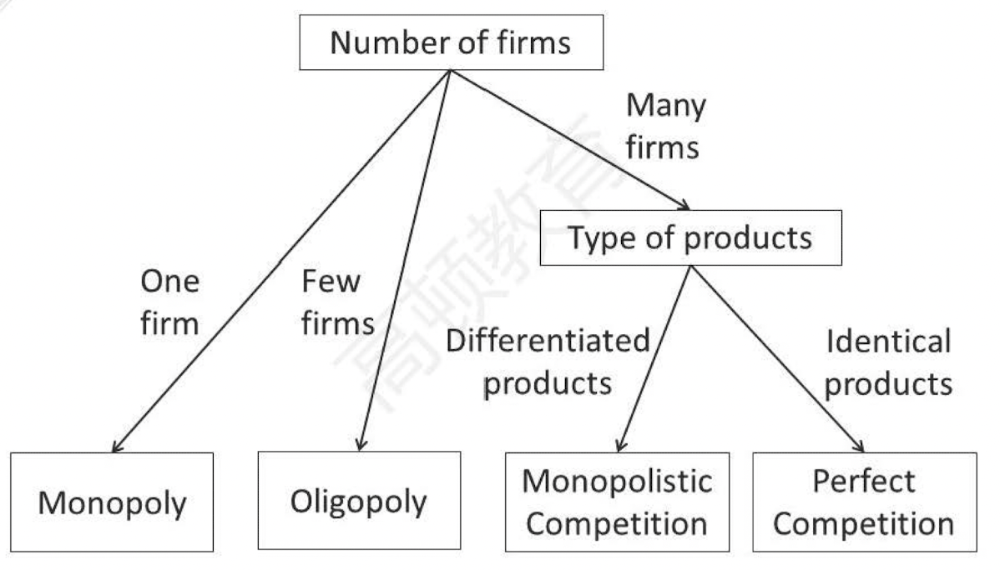
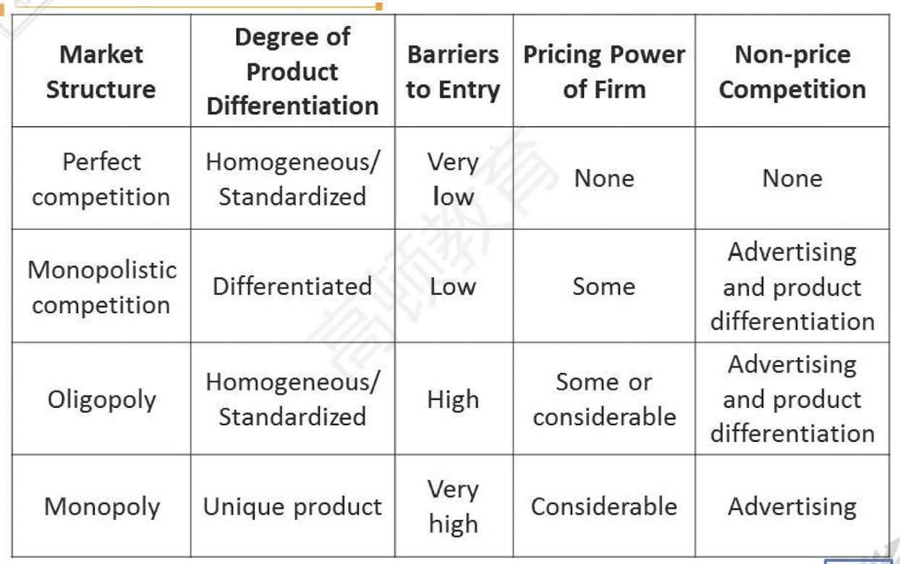
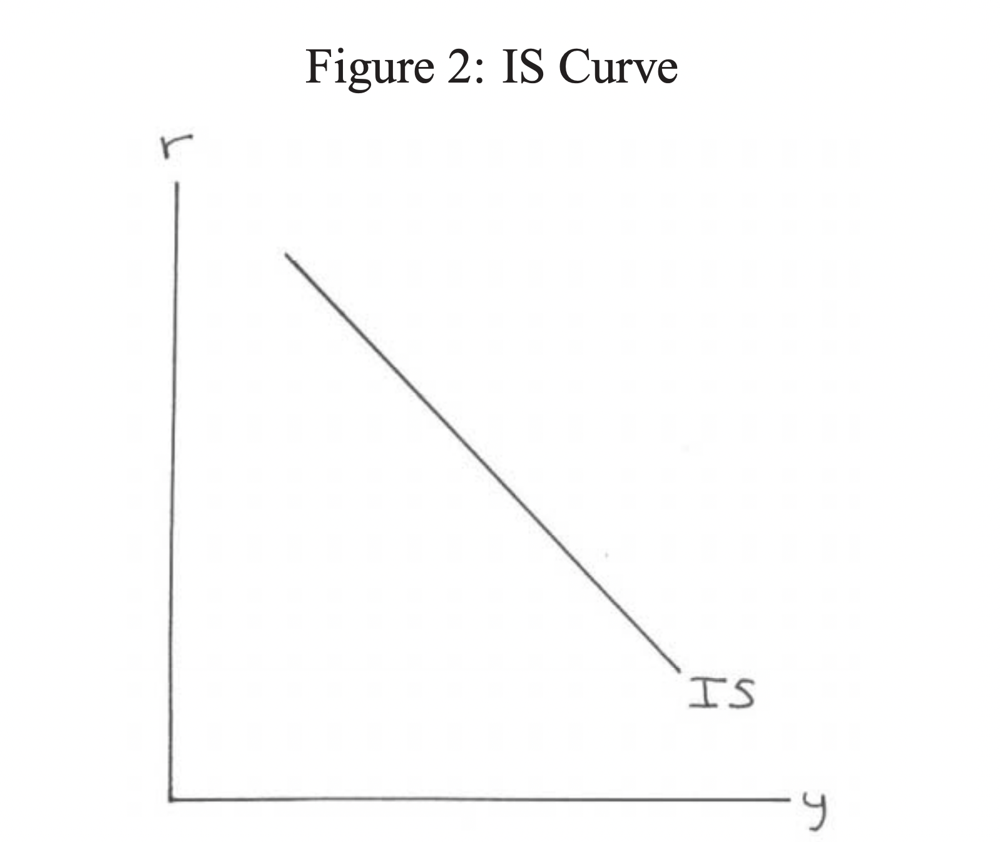
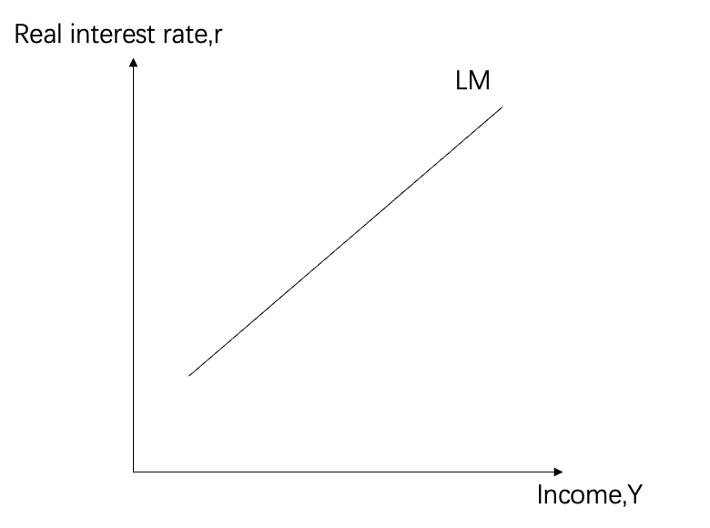
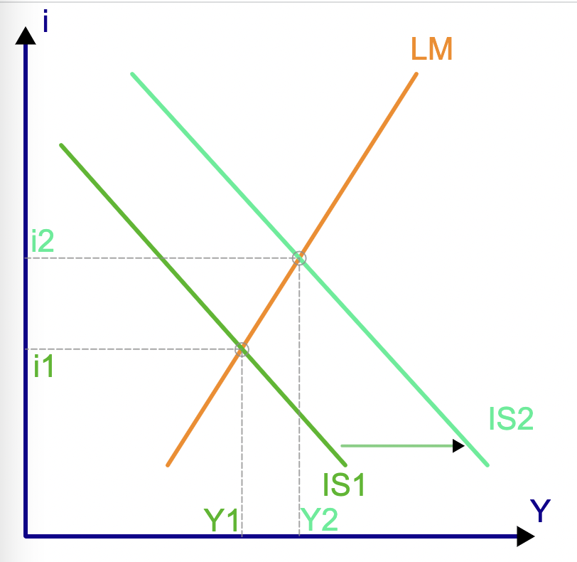
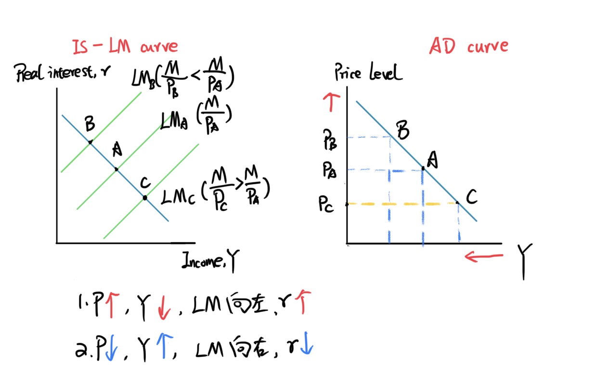
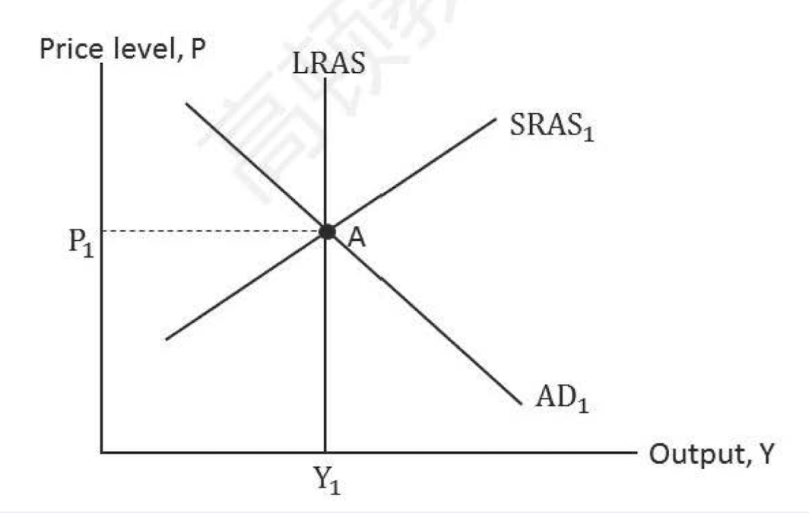

# 微观经济学

## Topics in demand and supply analysis

1. Demand analysis
   1. Demand concetps
      1. Law of demand 需求定律
      2. Demand function 需求函数
         1. 需求受到商品的价格、消费者的收入、消费者的口味、特定要求以及其他需求
         2. $$Q^d_x = f(P_x,I,P_y,...)$$
      3. Demand curve 需求曲线
         1. 定义：the graph of the inverse demand function.
         2. $$The\ slope\ of\ the\ demand\ curve = \frac{\Delta P_x}{\Delta Q_x}$$
   2. Consumer surplus 消费者剩余
       1. 消费者愿意支付的高于市场价格
   3. Elasticty of demand
       1. Own-price elasticity of demand 需求的自有价格弹性
          1. 定义：需求对于价格变动的弹性
          2. $$E^d_{P_x} = \frac{\%\Delta Q^d_x}{\%\Delta P_x}$$
          3. Value: mostly be negative
       2. Types of price elasticity of demand
          1. $$\epsilon_p = |\frac{\% change\ in\ Q_d}{\% change\ in\ P}|$$
          2. $$\epsilon_p  有三种情况，大于1，富有弹性；等于1，单位弹性；小于1，稀缺弹性；$$
          3. 两种极端情况跟
             1. Perfectly elastic（完全弹性），需求曲线是水平的；
             2. Perfectly inelastic(完全无弹性)，需求曲线是垂直的；
       3. Factors that influence price elasticity of demand
          1. 替代品越多，弹性越大；
          2. 在一个商品的预算比例；
          3. 时间；
          4. 可选的还是必须的；
       4. 单位弹性vs富有弹性和稀缺弹性
          1. 单位弹性：total revenue 最大
          2. 弹性：随着P降低，total revenue升高，所以move in opposite direction.
          3. 稀缺弹性，随着价格降低，total revenue降低，所以move in the same direction.

   4. Income elasticity of demand(收入弹性)
       1. 定义：需求对于收入的敏感度
       2. $$E^d_I = \frac{\% \Delta Q^d_x}{\% \Delta I}$$
       3. Normal goods(正常商品)，positive income elasticity
       4. Inferior goods(低档商品)：negative income elasticity

   5. Cross-price elasticity of demand(交叉价格弹性)
       1. Substitutes替代品：**positive** cross-price elasticity
       2. Complements互补品：**negative** cross-price elasticity

   6. Comprehensive effects of substitution and income effects
       1. Substitution effect(替代效应)
       2. Income effect(收入效应)
   7. Exceptions to the law of demand
       1. Giffen goods(吉芬商品)
       2. Veblen goods(韦伯伦商品)
   8. Summary
  

2. Supply analysis
    1. Production and product
       1. Factors and production
          1. 定义：The inputs(投入量) to the production of goods and service.
          2. Example: land,labor,capital,materials
       2. Production function(生产函数)
          1. Q = f(K, L)
          2. In the short-run:Capital is fixed,only consier **labor**.
             1. Q = f(L)

       3. Total product vs. Average Product vs. Marginal Product
       4. Increasing marginal return（边际回报递增）
       5. Diminishing marginal return(边际回报递减)
       6. **Revenue**
          1. $$MR = \frac{\Delta TR}{\Delta Q}$$
          2. $$MR = P[1 - \frac{1}{\epsilon _p}]$$
       7. Economic costs(机会成本) vs Acounting costs
          1. Total Economic costs = Explicit costs - Implicit costs
          2. Accounting profit = Total revenue - Explicit costs
          3. Economic profit = Total revenue - Explicit costs - Implicit costs
          4. Normal profit(正常盈利)：Economic profit = 0

       8. **Costs**
          1. Short-run cost curve
          2. TC = TFC + TVC
          3. Short-run average cost curve
          4. ATC = AFC + AVC
          5. Short-run average and marginal cost curve

       9. Perfect competion(完全竞争市场)
           1. P = MR = AR

       10. Imperfect competion(不完全竞争)

              

       11. Shutdown and breakeven point(停业和盈亏平衡点)

            Revenue vs. Cost | Short-Run | Long-Run
            ---------|----------|---------
            AR ≥ ATC | stay | Stay
            ATC > AR ≥  AVC|  Stay | Exit
            AR < AVC | Shutdown | Exit

       12. Profit maximization(盈利最大化)
           1. The difference between total revenue(TR) and total costs(TC) is the greatest.
           2. MR = MC

       13. Profit maximizing in the short run
            1. MR = MC = P
       14. Profit maximizing in the long run
            1. MR = MC = P = LRATC
            2. Firms earn zero economic profit in perfect competition

       15. Long run efficient scale(MES) 成本最低有效规模
           1. 定义：the scale the firm can produce at lowedst average cost
           2. The minimum point on the LRATC
           3. Economies of scale 规模经济
           4. Constant returns to scale 规模报酬恒定
           5. Diseconomies of scale 规模不经济

## The firm and market structures

### Perect competition 完全竞争市场

1. 完全竞争市场的特征
2. 利润最大化
   1. MR = MC
   2. Long-run equilibrium
      1. MR = MC = P = LRATC
   3. Short-run equibrium
3. 长期均衡
4. 短期供给函数

### Monopolistic competition

1. 垄断竞争市场的特征
   1. A **lager number** of potential buyers and sellers
   2. **Differentiated** products
   3. Entry into and exit from the market are with **farily low costs**
   4. **some pricing power**
   5. Suppliers differentiate their products through **advertising and other non-price startegies.**
2. 利润最大化
   1. MR = MC
   2. Long run equilibrium: P = ATC
   3. **No firms earns economic profit.**
3. 垄断竞争 vs. 完全竞争
   1. Demand curve
      1. Firms in the **monopolistic competition market face downward-sloping,highly elastic demand curves.**
      2. Firms in the competition market face **horizontal demand curve.**
   2. No economic profit in the long-run

### Oligopoly

1. 寡头市场的特点
   1. A **small number** of potential sellers(相较于垄断竞争)
   2. Products are **close or differentiated**
   3. Entry into the market is **difficult**
   4. **Substantial** pricing power
   5. Products are highly differentiated through **marketing,features and other non-price startegies.**
2. Pricing strategies 定价策略
   1. Kinked demand curve model 拐着需求线模型
      1. 假设：一个公司产品的涨价不会被其他公司追随，但是公司产品的降价将会被其他公司追随。
      2. Elasticity of demand is greater when price increase than decrease.
      3. **Sticky price**: price could be irresponsive to cost shift.
   2. Cournot model 古诺的双寡头模型
      1. 假设：A和B企业。站在A的角度，假设B不变，聚焦于A企业的利润最大化。
      2. 长期来看，产出和价格是稳定的。价格和产出都不会影响各自公司的利润。
   3. Nash equilibrium 纳什均衡
      1. 定义：纳什均衡（英语：Nash equilibrium，或称纳什均衡点）是指在包含两个或以上参与者的**非合作博弈（Non-cooperative game）**中，假设每个参与者都知道其他参与者的均衡策略的情况下，没有参与者可以透过改变自身策略使自身受益时的一个概念解。
      2. Cartel: 公司可以公开地达成**串通协议**
      3. **Collusion（串谋）**：firms make an agreement among themselves to avoid various competitive practices.
         1. 串谋的原因：增加利润，减少现金开支，构建壁垒
         2. **影响串谋成功的原因：**
            1. 小、不同的市场份额；
            2. 相似的产品；
            3. 成本结构相似；
            4. 订单规模小；
            5. Severe retaliation 严重的报复；
   4. Stackelberg model 斯坦伯格模型
      1. **Dominant firm(DF) 主导厂商** has a large market share with scale effect, **determining the market price** as a monopoly company,when MR= MC.
      2. Other competitive firms(CF) take market price as given.

### Monopoly

1. 垄断竞争的特点
   1. singler seller
   2. no close substitue
   3. entry diffcult
   4. considerable pricing power
   5. 产品是差异化的，可以通过非定价策略例如advertising
2. 利润最大化
   1. MC = MR
   2. 短期存在economic profits
3. Types of bariers to entry
   1. Government licensing and legal barriers 国家发放许可
   2. resource control 资源控制
   3. natural monopoly 自然垄断（自来水、电力、通信）--> 政府接入监管价格
      1. P = ATC，no economic profit(**preferred**)
      2. P = MC, government subsidy 政府补贴.
4. Types of price discrimination(价格歧视)
   1. first-degree price discriminatiojn 一级价格歧视： 给每个消费者愿意支付最高的价格
   2. second-degree price discrimination 二级价格歧视： 购买多，给折扣，购买少无折扣；
   3. three-degree price discrimination 三级价格歧视： 消费者通过人口特征或者其他特征进行分类；

5. Monopoly vs. Monopoly price discrimination
   1. 实现价格歧视减少无效的配置，增加供应；
   2. 消费者剩余减少；
   3. 公司的利润可以增加；

      

      

### Industry Concentration Simpler Measures 行业集中度

1. N firm concentration ratio(N公司集中值)
   1. 缺点
      1. 没有反应进入者的威胁；
      2. 没有反应兼并；
      3. 没有考虑需求弹性；
   2. 计算
2. HHI（Herfindahl-Hirschman Index) 赫芬达尔-赫希曼指数
   1. 缺点
      1. 没有反应进入者的威胁；
      2. 没有考虑需求弹性；
   2. 计算

# 宏观经济学

## Aggregate output,Prices,and Economic Growth

### Measurement of GDP

1. Aggregate output,income and expenditure
   1. Aggregate output(AO) 总产出
   2. Aggregate income(AI) 总收入
   3. Aggregate expenditure(AE) 总支出
   4. AO = AI = AE
2. Gross domestic product(GDP)
   1. key points of GDP
      1. **In a given period of time**
      2. Newly produced **goods and services**
      3. **Market value**
      4. **Excettions**: rent of own house,government services.
      5. Final **goods ans services.**
   2. Exclued:
      1. 二手商品
      2. 失业补助金
      3. 正在生产的商品
      4. The value of labor not sold
      5. Underground economy 地下经济
3. GDP deflator 国内成产总值平减指数
   1. Nominal GDP 名义GDP
      1. $$Nominal\ GDP_t = \displaystyle\sum^N_{i=1} P_{i,current\ year} * Q_{i,current\ year} $$
   2. Real GDP 实际GDP
      1. $$Real\ GDP_t = \displaystyle\sum^N_{i=1} P_{i,base\ year} * Q_{i,current\ year} $$
   3. GDP deflator GDP平减指数
      1. $$GDP\ deflator = \frac{Nominal\ GDP}{Real\ GDP} * 100$$
4. GDP calculation

   1. $$GDP = C + I + G + ( X - M )$$
      1. C: consumer spending on final goods and services 消费者消费
      2. I: gross private domestic investment and changes in inventory(inventory investment) 私营企业投资
      3. G: government spending on final goods and services 政府支出
      4. X: exports （出口）
      5. M: imports (进口)

   2. Using the income approach
      1. $$GDP = National\ Income + CCA + SD$$
   3. Saving,investment,fiscal balance and trade balance
      1. 支出方法：
         1. $$GDP = C + I + G + (X-M)$$
      2. 收入法
         1. $$GDP = C + S + T$$
         2. C: consumer spending
         3. S: household and business savings
         4. T: taxes
      3. $$S-I = (G-T)+(X-M) = fiscal\ balance + trade\ balance$$
         1. G-T> 0,government deficit;else,government surplus;

         2. X-M>0,trade surplus;else deficit(亏空);

### IS and LM curve

1. IS curve
   1. Aggregate income(AI）= Aggregate expenditure(AE)
   2. C + S + T = C + I + G + (X - M)
   3. S = I + (G - T) + (X - M)
   4. 假设G-T 和 X-M没有发生任何变化，那么：
      1. $$S(Y) = I(r)$$
      2. IS CURVE：
         1. 定义：IS curve presents an **inverse** relationship between income and real interest rate.
         2.   

2. LM curve
   1. Quantity theory of meony(货币数量理论)
      1. MV = PY
         1. M: Nominal money supply 名义货币供给
         2. V: Velocity of money in transactions 货币的流转速率
         3. P: Price level 物价水平
         4. Y: Real income/expenditure/output 实际GDP
      2. Money neutrality（货币中性理论）: 增加货币供给量，仅仅增加物价水平，不能增加总产出。
3. Keynes's demand for money theory
   1. $$M_s/P = M_d(r,Y)$$
   2. Transactions demand for money（交易性货币需求）
   3. Precautionary demand for money (预防性货币需求)
   4. Speculative demand for money (投机性货币需求)
   5. LM curve
     
      1. Md(r,Y) increases with the decrease of real interest rate and the rise of GDP.
      2. LM curve presents a **positive** relationship between income and real interest rate.

4. IS-LM curve
   1. IS-LM curve
      
   2. The **intersection** of the IS and LM curves determines the combination of real output and real interest rate.

### AD and AS curve

1. AD curve
   1. The aggregate demand curve 总需求曲线
   2.   

2. AS curve
   1. Very short run(VSR): 超短期，价格不会变化；
   2. Short run: curve is upward sloping；短期P上升，总产出上升；
   3. Long run: 成本上升，物价上升，成本和物价相互抵消，不会影响总产出；
      1. **perfectly inelastic**
      2. The level of output as potential GDP（潜在GDP）
      3. Full emplyment GDP(充分就业GDP)
      4. Natual rate of unemployment(自然失业率)
   4. Factors that shift the short-run aggregate supply(不好的都是向做移).

### Macroeconomic EQUILIBRIUM

Types of macroeconomic equilibrium

1. Long-run full employment(充分就业)
   1. Under long-run full employment euqilibrium,the economy is at potential real GDP.
   2. Both labor and capital are fully employed.
   3.
     

2. Short-run recessionary gap（衰退差）
   1. 实际GDP < 潜在GDP
   2. 失业率 > 自然失业率
   3. AD线向左移
   4. Policy choice:
      1. do nothing since there's a **self-correcting(自我修复)** mechanism.
      2. **Fiscal and monetary** policy to shift AD to the right.
   5. Investment implications of a decrease in AD
      1. 减少投资周期股，投资防御性企业
      2. 减少投资大宗商品
      3. 投资投资级债券，减少投资投机级别债券
      4. 投资长期债，利率下降，长期债涨幅更多；
3. Short-run inflationary gap（通胀差）
   1. Caused by ian increase in AD.
   2. 实际GDP > 潜在GDP
   3. 失业率 < 潜在自然失业率
   4. Policy choice:
      1. do nothing since there's a **self-correcting(自我修复)** mechanism.
      2. Fiscal and monetary policy to shift AD to the left.
   5. Investment implications of an incrase in AD
      1. 增加投资周期股，减少投资防御股
      2. 增加投资大宗商品
      3. 减少投资投资级别固定债券，减少投资长期债券；加息，通常意味着，bond下跌；
4. Short-run stagflation（滞胀差）经济停滞，物价上涨
   1. Caused by a decrase in AS
   2. High inflation
   3. 失业率>潜在失业率
   4. policy choice:
      1. Governement is least likely to interfere.
      2. No short-term economic policy is thought to be effective.

   5. Investment implications of a decrease in AS
      1. 减少投资固定收益
      2. 减少投资股票
      3. 减少投资大宗商品

### Economic Growth and Sustainability

1. The production function and potential GDP
   1. Production function:  
        $$Y = Af(L,K) $$
      1. A: total factor productivity(TFP) 全要素生产率或者科技水平
      2. $$Protential\ GDP\ growth = Technology\ growht + W_L(Growth\ in\ labor) + W_C(Growth\ in\ capital)$$
   2. Output per worker: Y/L = Af(K/L)
      1. $$Per\ Capital\ GDP\ grwoth = Technoglogy\ growth + W_C(Growth\ in\ capital-to-labor\ ratio)$$
2. Measures of sustainable growth
   1. Labor productivity: 一个工人在一个小时产出的商品和服务
   2. Labor productivity = real GDP / aggregate hours
   3. Potential GDP = aggregate hours worked * labor productivity
   4. **Protential GDP growth rate = long-term growth rate of labor force + long-term labor productivity growth rate**

## Understanding Business Cycles

## Monetary and fiscal Policy

# 国际贸易、汇率、资本流动

### International Trade and Capital Flows

### Currency Exchange Rates
