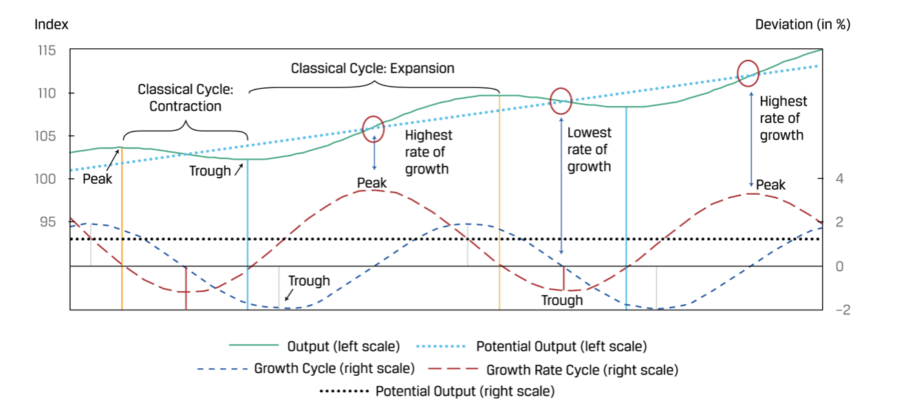
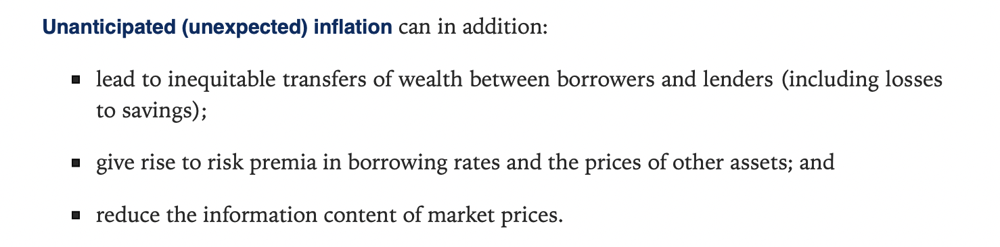

# 微观经济学

## Topics in demand and supply analysis

1. Demand analysis
   1. Demand concetps
      1. Law of demand 需求定律
      2. Demand function 需求函数
         1. 需求受到商品的价格、消费者的收入、消费者的口味、特定要求以及其他需求
         2. $$Q^d_x = f(P_x,I,P_y,...)$$
      3. Demand curve 需求曲线
         1. 定义：the graph of the inverse demand function.
         2. $$The\ slope\ of\ the\ demand\ curve = \frac{\Delta P_x}{\Delta Q_x}$$
   2. Consumer surplus 消费者剩余
       1. 消费者愿意支付的高于市场价格
   3. Elasticty of demand
       1. Own-price elasticity of demand 需求的自有价格弹性
          1. 定义：需求对于价格变动的弹性
          2. $$E^d_{P_x} = \frac{\%\Delta Q^d_x}{\%\Delta P_x}$$
          3. Value: mostly be negative
       2. Types of price elasticity of demand
          1. $$\epsilon_p = |\frac{\% change\ in\ Q_d}{\% change\ in\ P}|$$
          2. $$\epsilon_p  有三种情况，大于1，富有弹性；等于1，单位弹性；小于1，稀缺弹性；$$
          3. 两种极端情况跟
             1. Perfectly elastic（完全弹性），需求曲线是水平的；
             2. Perfectly inelastic(完全无弹性)，需求曲线是垂直的；
       3. Factors that influence price elasticity of demand
          1. 替代品越多，弹性越大；
          2. 在一个商品的预算比例；
          3. 时间；
          4. 可选的还是必须的；
       4. 单位弹性vs富有弹性和稀缺弹性
          1. 单位弹性：total revenue 最大
          2. 弹性：随着P降低，total revenue升高，所以move in opposite direction.
          3. 稀缺弹性，随着价格降低，total revenue降低，所以move in the same direction.

   4. Income elasticity of demand(收入弹性)
       1. 定义：需求对于收入的敏感度
       2. $$E^d_I = \frac{\% \Delta Q^d_x}{\% \Delta I}$$
       3. Normal goods(正常商品)，positive income elasticity
       4. Inferior goods(低档商品)：negative income elasticity

   5. Cross-price elasticity of demand(交叉价格弹性)
       1. Substitutes替代品：**positive** cross-price elasticity
       2. Complements互补品：**negative** cross-price elasticity

   6. Comprehensive effects of substitution and income effects
       1. Substitution effect(替代效应)
       2. Income effect(收入效应)
   7. Exceptions to the law of demand
       1. Giffen goods(吉芬商品)
       2. Veblen goods(韦伯伦商品)
   8. Summary
  

2. Supply analysis
    1. Production and product
       1. Factors and production
          1. 定义：The inputs(投入量) to the production of goods and service.
          2. Example: land,labor,capital,materials
       2. Production function(生产函数)
          1. Q = f(K, L)
          2. In the short-run:Capital is fixed,only consier **labor**.
             1. Q = f(L)

       3. Total product vs. Average Product vs. Marginal Product
       4. Increasing marginal return（边际回报递增）
       5. Diminishing marginal return(边际回报递减)
       6. **Revenue**
          1. $$MR = \frac{\Delta TR}{\Delta Q}$$
          2. $$MR = P[1 - \frac{1}{\epsilon _p}]$$
       7. Economic costs(机会成本) vs Acounting costs
          1. Total Economic costs = Explicit costs - Implicit costs
          2. Accounting profit = Total revenue - Explicit costs
          3. Economic profit = Total revenue - Explicit costs - Implicit costs
          4. Normal profit(正常盈利)：Economic profit = 0

       8. **Costs**
          1. Short-run cost curve
          2. TC = TFC + TVC
          3. Short-run average cost curve
          4. ATC = AFC + AVC
          5. Short-run average and marginal cost curve

       9. Perfect competion(完全竞争市场)
           1. P = MR = AR

       10. Imperfect competion(不完全竞争)

              

       11. Shutdown and breakeven point(停业和盈亏平衡点)

            Revenue vs. Cost | Short-Run | Long-Run
            ---------|----------|---------
            AR ≥ ATC | stay | Stay
            ATC > AR ≥  AVC|  Stay | Exit
            AR < AVC | Shutdown | Exit

       12. Profit maximization(盈利最大化)
           1. The difference between total revenue(TR) and total costs(TC) is the greatest.
           2. MR = MC

       13. Profit maximizing in the short run
            1. MR = MC = P
       14. Profit maximizing in the long run
            1. MR = MC = P = LRATC
            2. Firms earn zero economic profit in perfect competition

       15. Long run efficient scale(MES) 成本最低有效规模
           1. 定义：the scale the firm can produce at lowedst average cost
           2. The minimum point on the LRATC
           3. Economies of scale 规模经济
           4. Constant returns to scale 规模报酬恒定
           5. Diseconomies of scale 规模不经济

## The firm and market structures

### Perect competition 完全竞争市场

1. 完全竞争市场的特征
2. 利润最大化
   1. MR = MC
   2. Long-run equilibrium
      1. MR = MC = P = LRATC
   3. Short-run equibrium
3. 长期均衡
4. 短期供给函数

### Monopolistic competition

1. 垄断竞争市场的特征
   1. A **lager number** of potential buyers and sellers
   2. **Differentiated** products
   3. Entry into and exit from the market are with **farily low costs**
   4. **some pricing power**
   5. Suppliers differentiate their products through **advertising and other non-price startegies.**
2. 利润最大化
   1. MR = MC
   2. Long run equilibrium: P = ATC
   3. **No firms earns economic profit.**
3. 垄断竞争 vs. 完全竞争
   1. Demand curve
      1. Firms in the **monopolistic competition market face downward-sloping,highly elastic demand curves.**
      2. Firms in the competition market face **horizontal demand curve.**
   2. No economic profit in the long-run

### Oligopoly

1. 寡头市场的特点
   1. A **small number** of potential sellers(相较于垄断竞争)
   2. Products are **close or differentiated**
   3. Entry into the market is **difficult**
   4. **Substantial** pricing power
   5. Products are highly differentiated through **marketing,features and other non-price startegies.**
2. Pricing strategies 定价策略
   1. Kinked demand curve model 拐着需求线模型
      1. 假设：一个公司产品的涨价不会被其他公司追随，但是公司产品的降价将会被其他公司追随。
      2. Elasticity of demand is greater when price increase than decrease.
      3. **Sticky price**: price could be irresponsive to cost shift.
   2. Cournot model 古诺的双寡头模型
      1. 假设：A和B企业。站在A的角度，假设B不变，聚焦于A企业的利润最大化。
      2. 长期来看，产出和价格是稳定的。价格和产出都不会影响各自公司的利润。
   3. Nash equilibrium 纳什均衡
      1. 定义：纳什均衡（英语：Nash equilibrium，或称纳什均衡点）是指在包含两个或以上参与者的**非合作博弈（Non-cooperative game）**中，假设每个参与者都知道其他参与者的均衡策略的情况下，没有参与者可以透过改变自身策略使自身受益时的一个概念解。
      2. Cartel: 公司可以公开地达成**串通协议**
      3. **Collusion（串谋）**：firms make an agreement among themselves to avoid various competitive practices.
         1. 串谋的原因：增加利润，减少现金开支，构建壁垒
         2. **影响串谋成功的原因：**
            1. 小、不同的市场份额；
            2. 相似的产品；
            3. 成本结构相似；
            4. 订单规模小；
            5. Severe retaliation 严重的报复；
   4. Stackelberg model 斯坦伯格模型
      1. **Dominant firm(DF) 主导厂商** has a large market share with scale effect, **determining the market price** as a monopoly company,when MR= MC.
      2. Other competitive firms(CF) take market price as given.

### Monopoly

1. 垄断竞争的特点
   1. singler seller
   2. no close substitue
   3. entry diffcult
   4. considerable pricing power
   5. 产品是差异化的，可以通过非定价策略例如advertising
2. 利润最大化
   1. MC = MR
   2. 短期存在economic profits
3. Types of bariers to entry
   1. Government licensing and legal barriers 国家发放许可
   2. resource control 资源控制
   3. natural monopoly 自然垄断（自来水、电力、通信）--> 政府接入监管价格
      1. P = ATC，no economic profit(**preferred**)
      2. P = MC, government subsidy 政府补贴.
4. Types of price discrimination(价格歧视)
   1. first-degree price discriminatiojn 一级价格歧视： 给每个消费者愿意支付最高的价格
   2. second-degree price discrimination 二级价格歧视： 购买多，给折扣，购买少无折扣；
   3. three-degree price discrimination 三级价格歧视： 消费者通过人口特征或者其他特征进行分类；

5. Monopoly vs. Monopoly price discrimination
   1. 实现价格歧视减少无效的配置，增加供应；
   2. 消费者剩余减少；
   3. 公司的利润可以增加；

      

      

### Industry Concentration Simpler Measures 行业集中度

1. N firm concentration ratio(N公司集中值)
   1. 缺点
      1. 没有反应进入者的威胁；
      2. 没有反应兼并；
      3. 没有考虑需求弹性；
   2. 计算
2. HHI（Herfindahl-Hirschman Index) 赫芬达尔-赫希曼指数
   1. 缺点
      1. 没有反应进入者的威胁；
      2. 没有考虑需求弹性；
   2. 计算

# 宏观经济学

## Aggregate output,Prices,and Economic Growth

### Measurement of GDP

1. Aggregate output,income and expenditure
   1. Aggregate output(AO) 总产出
   2. Aggregate income(AI) 总收入
   3. Aggregate expenditure(AE) 总支出
   4. AO = AI = AE
2. Gross domestic product(GDP)
   1. key points of GDP
      1. **In a given period of time**
      2. Newly produced **goods and services**
      3. **Market value**
      4. **Excettions**: rent of own house,government services.
      5. Final **goods ans services.**
   2. Exclued:
      1. 二手商品
      2. 失业补助金
      3. 正在生产的商品
      4. The value of labor not sold
      5. Underground economy 地下经济
3. GDP deflator 国内成产总值平减指数
   1. Nominal GDP 名义GDP
      1. $$Nominal\ GDP_t = \displaystyle\sum^N_{i=1} P_{i,current\ year} * Q_{i,current\ year} $$
   2. Real GDP 实际GDP
      1. $$Real\ GDP_t = \displaystyle\sum^N_{i=1} P_{i,base\ year} * Q_{i,current\ year} $$
   3. GDP deflator GDP平减指数
      1. $$GDP\ deflator = \frac{Nominal\ GDP}{Real\ GDP} * 100$$
4. GDP calculation

   1. $$GDP = C + I + G + ( X - M )$$
      1. C: consumer spending on final goods and services 消费者消费
      2. I: gross private domestic investment and changes in inventory(inventory investment) 私营企业投资
      3. G: government spending on final goods and services 政府支出
      4. X: exports （出口）
      5. M: imports (进口)

   2. Using the income approach
      1. $$GDP = National\ Income + CCA + SD$$
   3. Saving,investment,fiscal balance and trade balance
      1. 支出方法：
         1. $$GDP = C + I + G + (X-M)$$
      2. 收入法
         1. $$GDP = C + S + T$$
         2. C: consumer spending
         3. S: household and business savings
         4. T: taxes
      3. $$S-I = (G-T)+(X-M) = fiscal\ balance + trade\ balance$$
         1. G-T> 0,government deficit;else,government surplus;

         2. X-M>0,trade surplus;else deficit(亏空);

### IS and LM curve

1. IS curve
   1. Aggregate income(AI）= Aggregate expenditure(AE)
   2. C + S + T = C + I + G + (X - M)
   3. S = I + (G - T) + (X - M)
   4. 假设G-T 和 X-M没有发生任何变化，那么：
      1. $$S(Y) = I(r)$$
      2. IS CURVE：
         1. 定义：IS curve presents an **inverse** relationship between income and real interest rate.
         2.   

2. LM curve
   1. Quantity theory of meony(货币数量理论)
      1. MV = PY
         1. M: Nominal money supply 名义货币供给
         2. V: Velocity of money in transactions 货币的流转速率
         3. P: Price level 物价水平
         4. Y: Real income/expenditure/output 实际GDP
      2. Money neutrality（货币中性理论）: 增加货币供给量，仅仅增加物价水平，不能增加总产出。
3. Keynes's demand for money theory
   1. $$M_s/P = M_d(r,Y)$$
   2. Transactions demand for money（交易性货币需求）
   3. Precautionary demand for money (预防性货币需求)
   4. Speculative demand for money (投机性货币需求)
   5. LM curve
     
      1. Md(r,Y) increases with the decrease of real interest rate and the rise of GDP.
      2. LM curve presents a **positive** relationship between income and real interest rate.

4. IS-LM curve
   1. IS-LM curve
      
   2. The **intersection** of the IS and LM curves determines the combination of real output and real interest rate.

### AD and AS curve

1. AD curve
   1. The aggregate demand curve 总需求曲线
   2.   

2. AS curve
   1. Very short run(VSR): 超短期，价格不会变化；
   2. Short run: curve is upward sloping；短期P上升，总产出上升；
   3. Long run: 成本上升，物价上升，成本和物价相互抵消，不会影响总产出；
      1. **perfectly inelastic**
      2. The level of output as potential GDP（潜在GDP）
      3. Full emplyment GDP(充分就业GDP)
      4. Natual rate of unemployment(自然失业率)
   4. Factors that shift the short-run aggregate supply(不好的都是向做移).

### Macroeconomic EQUILIBRIUM

Types of macroeconomic equilibrium

1. Long-run full employment(充分就业)
   1. Under long-run full employment euqilibrium,the economy is at potential real GDP.
   2. Both labor and capital are fully employed.
   3.
     

2. Short-run recessionary gap（衰退差）
   1. 实际GDP < 潜在GDP
   2. 失业率 > 自然失业率
   3. AD线向左移
   4. Policy choice:
      1. do nothing since there's a **self-correcting(自我修复)** mechanism.
      2. **Fiscal and monetary** policy to shift AD to the right.
   5. Investment implications of a decrease in AD
      1. 减少投资周期股，投资防御性企业
      2. 减少投资大宗商品
      3. 投资投资级债券，减少投资投机级别债券
      4. 投资长期债，利率下降，长期债涨幅更多；
3. Short-run inflationary gap（通胀差）
   1. Caused by ian increase in AD.
   2. 实际GDP > 潜在GDP
   3. 失业率 < 潜在自然失业率
   4. Policy choice:
      1. do nothing since there's a **self-correcting(自我修复)** mechanism.
      2. Fiscal and monetary policy to shift AD to the left.
   5. Investment implications of an incrase in AD
      1. 增加投资周期股，减少投资防御股
      2. 增加投资大宗商品
      3. 减少投资投资级别固定债券，减少投资长期债券；加息，通常意味着，bond下跌；
4. Short-run stagflation（滞胀差）经济停滞，物价上涨
   1. Caused by a decrase in AS
   2. High inflation
   3. 失业率>潜在失业率
   4. policy choice:
      1. Governement is least likely to interfere.
      2. No short-term economic policy is thought to be effective.

   5. Investment implications of a decrease in AS
      1. 减少投资固定收益
      2. 减少投资股票
      3. 减少投资大宗商品

### Economic Growth and Sustainability

1. The production function and potential GDP
   1. Production function:  
        $$Y = Af(L,K) $$
      1. A: total factor productivity(TFP) 全要素生产率或者科技水平
      2. $$Protential\ GDP\ growth = Technology\ growht + W_L(Growth\ in\ labor) + W_C(Growth\ in\ capital)$$
   2. Output per worker: Y/L = Af(K/L)
      1. $$Per\ Capital\ GDP\ grwoth = Technoglogy\ growth + W_C(Growth\ in\ capital-to-labor\ ratio)$$
2. Measures of sustainable growth
   1. Labor productivity: 一个工人在一个小时产出的商品和服务
   2. Labor productivity = real GDP / aggregate hours
   3. Potential GDP = aggregate hours worked * labor productivity
   4. **Protential GDP growth rate = long-term growth rate of labor force + long-term labor productivity growth rate**

## Understanding Business Cycles

1. Characteristics and theories of business cycle
   1. 商业周期：trough（低谷）、expansion（扩张）、peak（顶峰）、contraction（衰退）
   2.  
     

     

2. Theories of the business cycle

      School| Cause of business cycle | Reconmened policy
      ---------|----------|---------
      Neoclassical 新古典主义 | Technology | Do nothing full-employment equilibrium
      Keynesian 凯恩斯主义 | Business expectations **downward sticky wages** | Fiscal or monetary policy
      New Keynesian  | Same as Keynesian,but other input prices also downward sticky | Fiscal or monetary policy
      Monetarist 货币主义|Inapppropriate changes in money supply growth rate | Steady and predictable growth rate of money supply
      Austrian 奥地利学派 | Government intervention干涉 | Don't force interest rates to artificially low level
      New classical 新古典主义 | Technology and external shocks | Don't intervene to counteract（对抗） business cycles

3. Unemployment

   1. Related concepts
      1. Employed
      2. Unemployed
      3. Labor force = employed + unemployed
      4. Underemployed (为充分就业)
      5. Discouraged worker(灰心气馁的工人)
      6. Voluntarily unemployed（自愿失业） -- outside of labor force and unemployed people
   2. Measure of unemployment
      1. **Unemployment rate = number of unemployed / labor force**
      2. **Activity ratio(Participation ratio) 劳动参与率= labor force /working-age population**
   3. Three types of unemployment
      1. Fritional unemployment(摩擦性失业) 雇员和雇主暂时无法匹配
      2. Structural unemployment（结构性失业）经济周期发生变化，需要工人掌握新的技能
      3. Types of unemployment and full employment（周期性失业）results from changes in economic growht.
   4. Full employment: no cyclical unemployment（无周期性失业），结构性和摩擦性事业依然存在。

4. Inflation
   1. Inflation(通货膨胀概念)
      1. 定义：a **sustained rise持续上升** in the overall level of prices.
      2. Inflation rate：**the percentage change** in a price index the speed of overall price level movements.
      3. Hyperinflation(恶性通货膨胀): 一个极端的通货膨胀
      4. Stagflation(滞涨)：**一个高的通货膨胀水平和一个高的失业率以及下滑的经济。**
      5. deflation(通货紧缩)：价格下降，负的通货膨胀率
      6. disinflation(通货收缩)：**一个正的但是下降的通货膨胀率**
   2. Inflation measurement
      1. Lasperyres index(拉斯拜尓指数)
         1. 假设销量不发生变化，只考虑当前价格发生的变化
         2. $$Laspeyres index = I_L = \frac{\sum Q_0*P_1}{\sum Q_0*P_0}$$
      2. Paasche index(派许指数)
         1. 假设当前的销量不发生变化，拿当前的价格和过去的价格做对比
         2. $$Paasche index = I_p = \frac{\sum Q_1*P_1}{\sum Q_1*P_0}$$
      3. Fisher index(费雪指数)
         1. 拉斯拜尔指数和派许指数的平均
      4. CPI(消费者购买)
         1. CPI = (cost of basket at current prices)/(Cost of basket at base period prices)
      5. PPI(公司购买)
      6. Headline inflation(整体通胀)：price indexes that include all goods an services.
      7. **Core inflation(核心通胀)：price indexes that exclude food and energy.**
         1. 通常用于做决策
   3. Cost-push inflation(成本推动通胀)
      1. 原因：**价格上涨导致AS线左移（不好的事情发生）**
      2. 失业率大于自然失业率；失业率大于自然失业率
   4. Demand-pull inflation(需求拉动通胀)
      1. 原因：**需求增长，AD线右移。**
      2. 特点：实际GDP>潜在GDP；失业率小于自然首页率

5. Economic Indicators

   1. Leading indicators
      1. 每周平均新增的事业补助申请
      2. S&P Stock index
      3. M2
      4. Interest rate spread between 10-year treasury yields and overnight borrrowing rates(federal funds rate)
   2. Coincident indicators(同步指标)
   3. Lagging indicators(滞后指标)
      1. inventory-sales ratio

     

## Monetary and fiscal Policy

### Monetary policy

1. Monetary policy 货币政策
   1. 定义：**Central bank 中央银行** activities that are directed toward **influencing the quantity of money and credit in an economy.**
2. Fiscal policy
   1. 定义：The government's decisions about **taxation** and **spending**.
   2. Budget surplus(预算盈余)
   3. Budget deficit（预算赤字）

3. Money creation process
   1. money multipllier(货币乘数) = 1 / reserve requirement(10%)
   2. Money created = new deposit * money multiplier
   3. Money created = new deposit * reserve requirement

4. The supply and demand for money
   1. 货币的供应量是受到中央银行的影响，并不受到利率的影响。

5. Fisher effect（费雪效应）
   1. 定义：the nominal interest rate is simply **the sum of the real interest rate** and **expected inflation.**
   2. To account for uncertainty of future,the nominal interest rate is comprised of :
      1. real required rate of return
      2. expected inflation
      3. risk premiums

6. Cost of expected inflation:
   1. menu cost 菜单成本
   2. shoe leater cost 鞋底成本
7. Cost of unexpected inflation
     

8. Roles and objectives of central bank
9. Qualities of effective central banks
   1. Independence 独立
      1. 目标独立
      2. 操作独立
   2. Credibility 有信誉度
   3. Transparency 透明度高

10. Policy targeting of central bank
    1. 利率目标
    2. 通胀目标
    3. 汇率目标

11. Monetary policy tools 货币市场操作
    1. Open market operations(公开市场操作)
       1. buy bond
       2. sell bond
    2. Reserve requirements(准备金要求)

12. policuy rate and associated 政策利率和相关操作
13. Impact of monetary policy on the economy
    1. Expansinonary monetary policy **trends to increase GDP**,降息以及decrease the value of local currency.
    2. Contractionary monetary policy **treands to decrease GDP**,生息以及increase the value of local currency.
14. Neutral interest rate(中性利率) = real trend rate of economic growth + inflation target
15. 货币政策的局限性
    1. Bond market vigilantes
    2. liquidity trap
    3. Quantitative easing（量化宽松）

### Fiscal policy

1. 财政政策目标：
   1. Objectives: help manage the economy throught its influence on aggregate national output,real GDP.
   2. Discretionary fiscal policy(相机财政政策)
   3. Automatic stabilizers（自动稳定器）

2. Fiscal policy tools
   1. Government spending（花钱）
      1. Transfer payment(转移支付) 纾困计划
      2. Current governemtn spending(goods and services) 日常开支
      3. Capital expenditure(rods,hospitals,schools) 大基建
   2. Government revenues（收入）
      1. Direct tax
      2. Indirect tax
   3. 优势：间接税优点
   4. 劣势：直接税缺点

3. Arguments against being concerned about national debt(支持)
   1. Richardian euqivalence(李嘉图均衡)：为了offset税，将会增加储蓄；
   2. 失业率下降
4. Arguments for being concerned about national debt（反对）
   1. 市场对于政府失去信心
   2. 更高的税率
   3. 挤出效应（crowding out effect），实体投资下降

5. 财政政策的缺点
   1. Recognition lag
   2. Action lag
   3. Impact lag

6. Structual budget deficit(结构预算赤字)：如果一个经济体为完全就业的话，那么将会存在赤字（政府花钱很多刺激经济嘛）；

## International Trade and Capital Flows

### International trade

1. 基本术语
   1. Open economy
   2. Closed economy
   3. Free trade
   4. Trade protection
   5. Terms of trade(贸易比价)

2. 比较优势和相对优势

3. Ricardian model(李嘉图模型)：李嘉图国际贸易模型是最简单的贸易理论模型之一，它的两个核心含义是：劳动生产率的差异在国际贸易中占据重要地位；贸易模式取决于比较优势而非绝对优势。

4. Heckscher-Ohlin model(赫克歇尔-俄林模型)：这个模型建立在李嘉图的比较优势理论之上，本模型建立在各国资源禀赋以及产品特性的基本差异上，赫克歇尔与奥林认为每个国家所拥有的生产要素丰富程度并不相同，不同的产品生产时所需要的生产要素也不相同，在这种情形下，一国若是生产某种产品，其密集使用了国内较为丰富的生产要素，便可以在生产此种产品时拥有比较优势。

### Trade and capital restriction

1. Common objectives of capital restrictions 资本管控的目标
   1. 减少本国资产的波动性
   2. 维护汇率
   3. 保持本国低利率
   4. 保护战略行业
2. Types of trade restrictions inclued
   1. Tariffs(关税)
   2. Quotas(配额): 进口商品有额度限制
   3. Export subsidies(出口补贴)
   4. Voluntary export restraint(VER)自愿出口补贴：是政府对在特定时间段内可以出口到特定国家的某种商品的数量施加的限制。它们有时被称为“出口签证”。通常，当行业寻求保护免受来自特定国家的竞争性进口产品时，就会出现 VER。然后出口国提供 VERs 以安抚进口国并阻止其施加明确的（和不太灵活的）贸易壁垒。
3. Tariff and import quota 关税和进口配额

### Balance of Payments(BOP)

1. Current account(经常账户) -- **goods and services.**
   1. Merchandise tade 商品贸易
   2. Services 服务
   3. Income receipts 工资收据
   4. Unilateral transfers 单方面转移支付
2. Capital account(资本账户)
   1. Capital transfers: 债务宽恕
   2. 购买非生产的非金融资产，例如专利、版权等
3. Financial account(金融账户) -- records investments flows.
   1. A country's assets abroad
   2. Foreign-owned assets in the reporting country
4. National economic accounts and BOP
   1. C + S + T = C + I + G + (X-M)
   2. X - M = S - I + (T - G)
   3. Current accont balance = X - M
   4. $$Current account = S_p + S_g - I$$
   5. Trade deficit 可以有哪些因素引起：
      1. 缺少私有储蓄
      2. 缺少政府储蓄
      3. 投资过于旺盛

### Cooperation and Trade Organization

1. Free Trade Areas(自由贸易区)
2. Customs Union(关税联盟)
3. Comon market(共同市场)
4. Economic Union(经济联盟)
5. Monetary Union（货币联盟）

## Currency Exchange Rates

1. Terminology and Calculation
   1. Exchange rate quotations
      1. USD/EUR = 1.1，即1EUR等于1.1个USD。
      2. EUR：base currency
      3. USD: price currency
   2. Exchange rate
      1. Nominal exchange rate(名义汇率)： the price that we observe in the marketplace for foreign exchange.
      2. Real exchange rate(实际汇率): adjust nominal exchange rate to **reflect the relative purchasing power between countries**.
      3. $$Real_{d/f} = Nominal_{d/f} * \frac{P_f}{P_d}$$ 
   3. 货币升值还是贬值
   4. 交叉汇率计算
   5. 即期汇率和远期汇率
   6. Interest rate parity(IRP) 利率平价
      1. 定义：The currency with **higher interest rate** will always trade **at a discount** in the forward market.
      2. The percentage difference between forward and spot exchange rates is approximately equal to the difference between the two contries' interest.
      3. $$\frac{F_{f/d}}{S_{f/d}} = \frac{1+r_f}{1+r_d}$$
      4. $$\frac{F-S}{S} = \frac{1+r_f}{1+r_d} -1 \approx r_f - r_d $$

   7. Currency regime 汇率制度
      1. No separate legal tender 例如巴拿马
      2. Currency board arrangement(货币局制度) 例如香港
      3. Fixed parity
         1. Conventional fixed peg arrangement(传统固定钉住安排)，和另外的货币有+/-1 %区间；
      4. Target zone（有一个区间），up to +/- 2% percent around the parity.
      5. Active and passive crawling pegs 主动和被动爬行钉
         1. Active: manipulate the expectations of inflation
         2. Passwive: adjust exchange rate based on inflation rate
      6. Fixed parity with crawling bands
      7. Managed float(管理浮动): floating with government intervention(without explicit target 没有明确的目标).
      8. Independently floating rates(独立浮动)：exchange rate is **left to market determination.**
2. Exchange Rate and Trade balance
   1. Elasticties approach 弹性法：进出口方至少有一方有弹性
   2. J-curve
      1. 短期恶化
      2. 长期改善
   3. Absorption approach 吸收理论
      1. Excessive capacity-> 贬值改善赤字
      2. No excessive capacity-> 贬值无效
